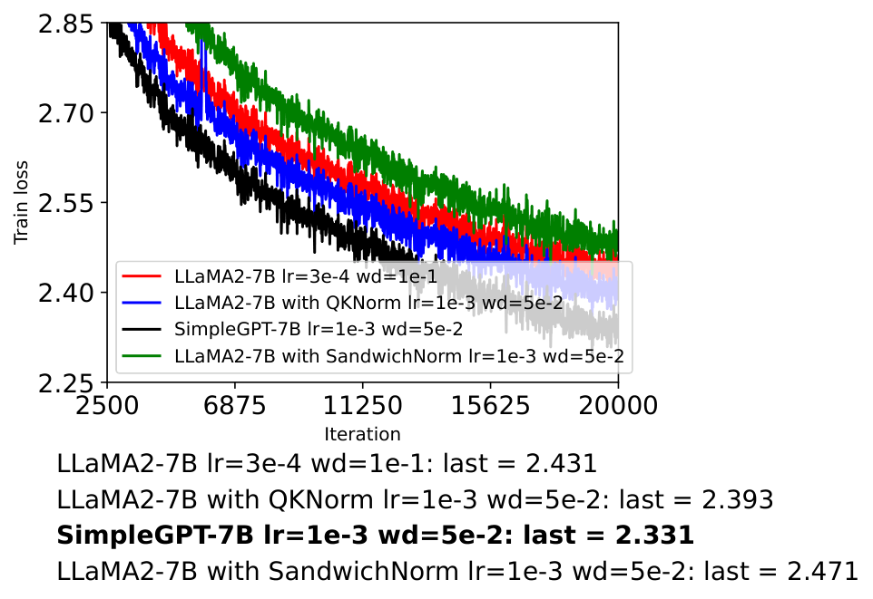
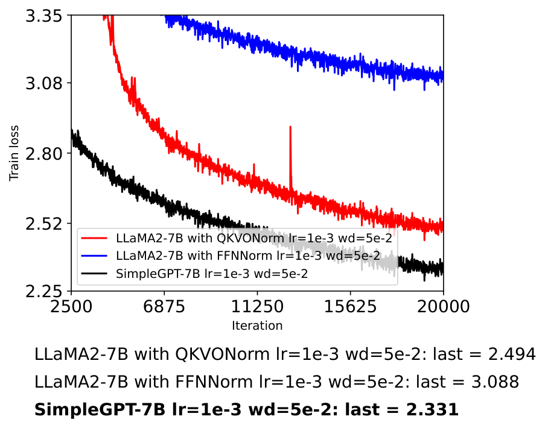
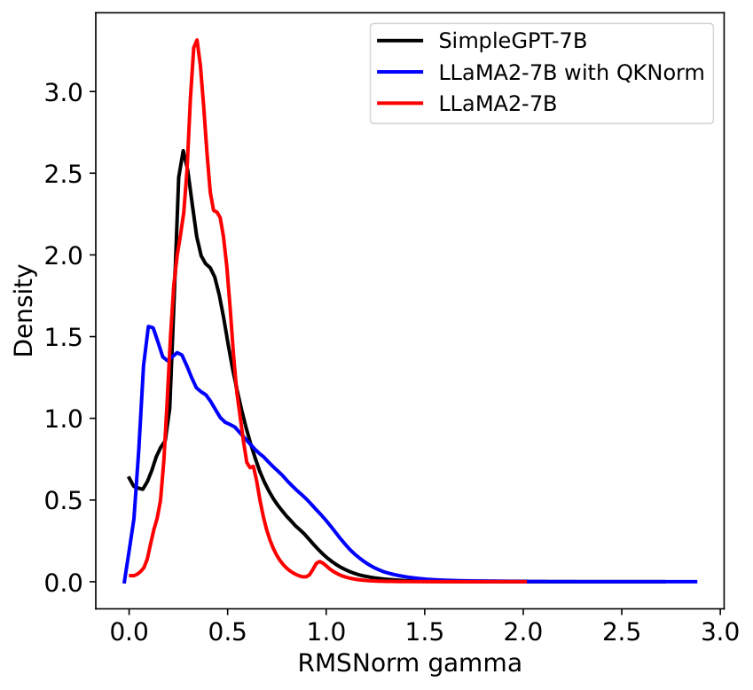

# ICML Rebuttal Figures

#### Figure 1: Comparison of training performance among LLaMA2-7B, LLaMA2-7B with QKNorm, LLaMA2-7B with SandwichNorm, and SimpleGPT-7B.

#### Figure 2: Ablation study of SimpleNorm. The blue curve corresponds to the model with SimpleNorm applied only to the FFN, the red curve corresponds to the model with SimpleNorm applied only to self-attention, and the black curve corresponds to SimpleGPT-7B.

#### Figure 3: Distribution statistics of the RMSNorm gain parameter $\gamma$ for LLaMA2-7B, LLaMA2-7B with QKNorm, and SimpleGPT-7B.

